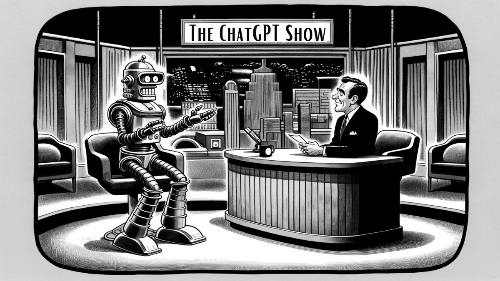
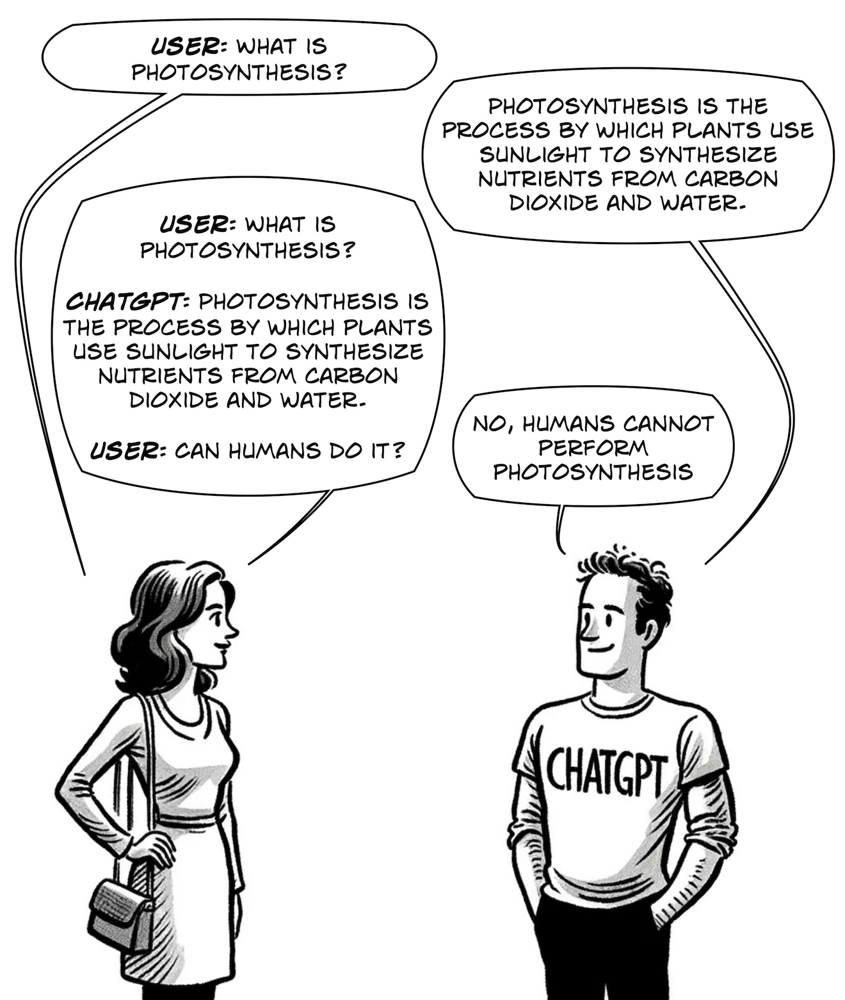
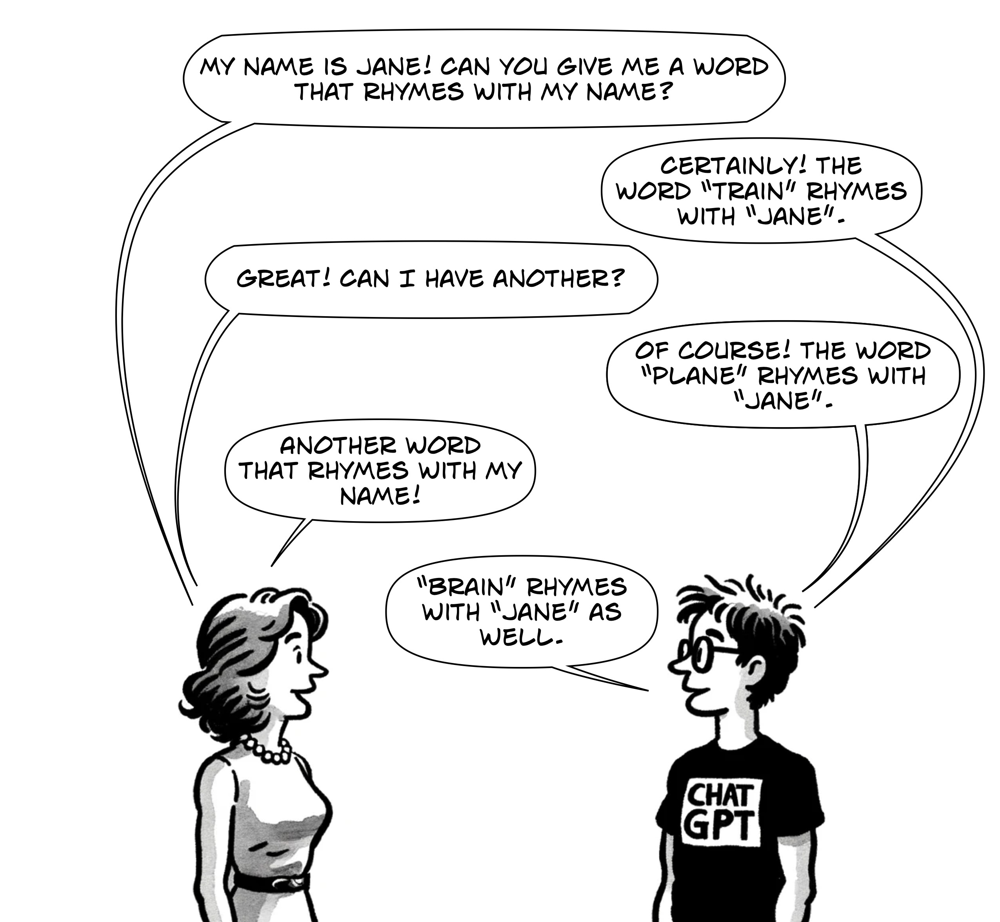
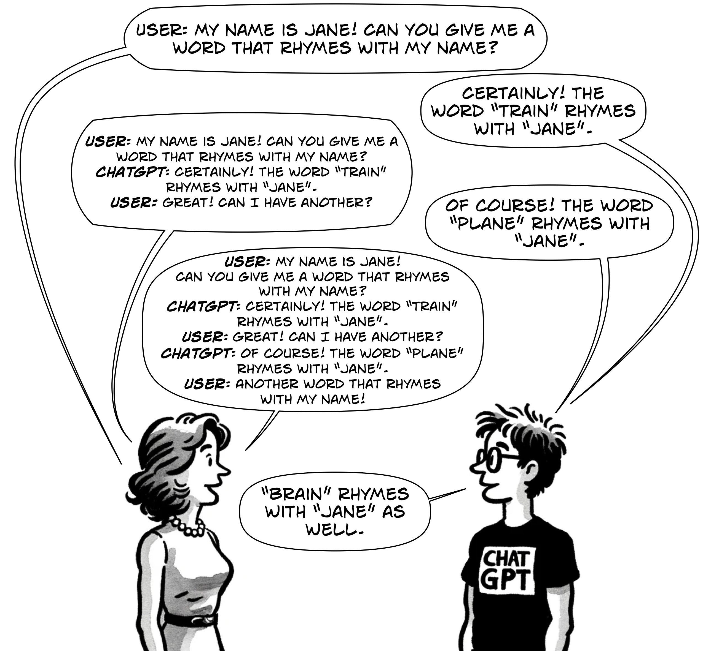
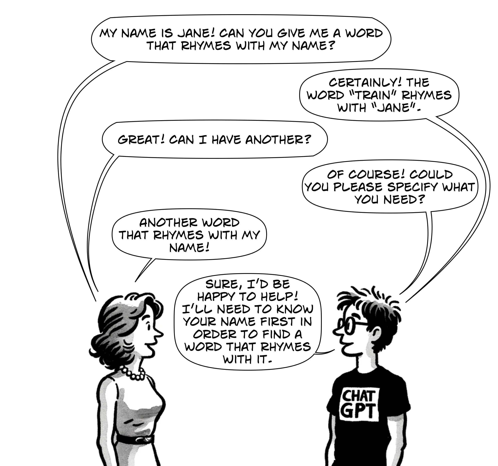

import Figure from "@site/src/components/figure";

Remember the first time you used ChatGPT and how amazed you were to find yourself having what appeared to be a full-on conversation with an artificial intelligence? While ChatGPT was (and still is) mind-blowing, it uses a few tricks to make things appear more familiar.

While the title of this article is a bit tongue-in-cheek, it is most certainly not clickbait. ChatGPT does indeed use two notable hidden techniques to simulate human conversation, and the more you know about how they work, the more effectively you can use the technology.

<!-- truncate -->

## Trick #1: Every time you talk to ChatGPT, you're not just sending it your question. You're also sending it the *entire* conversation up until that point.

Contrary to appearances, large language models (LLMs) like ChatGPT do not actually "remember" past interactions. The moment they finish "typing" out their response, they have no idea who you are or what you were talking about. When ChatGPT seems to naturally recall details from earlier in the conversation, it is an illusion; the context of that dialogue is given back to ChatGPT every time you say something to it. This context enables them to build coherent, follow-on responses that appear to be normal conversations.

However, without this context, ChatGPT would have no knowledge of what was previously discussed. Like all LLMs, ChatGPT is completely *stateless*, meaning that in the actual model itself, no information is maintained between inputs and outputs. All of this feeding of previous context into the current interaction is hidden behind the scenes in the ChatGPT web application.

### A typical short conversation with ChatGPT might go like this.

### However, this is what is actually going on behind the scenes.

Notice that when the woman asks her second question, she has to reiterate the entire previous conversation, complete with tags on who said what. Can you imagine talking to a person where every time it was your turn to speak, you had to repeat the entire conversation up to that point? This is how ChatGPT (and all current LLMs) work. They require using their own outputs, plus the prompts that generated these outputs, to be prepended to the start of every new prompt from the user.

These models are termed "auto-regressive" due to their method of generating text one piece at a time, building upon the previously generated text. "Auto-" comes from the Greek word "autós," meaning "self," and "regressive" is derived from "regress," which in this context refers to the statistical method of predicting future values based on past values.

In LLMs, what this means is that the model predicts the next word or token in a sequence based on *all* the words or tokens that have come before it. That's *all* of it, not just the current question being asked in a long back-and-forth chat conversation. In humans, we naturally maintain coherence and context in a conversation by just... participating in the conversation.

However, while chats with ChatGPT mimic a conversational style, with each response building upon the previous dialogue, the moment ChatGPT finishes writing a response, it has no memory of what it just said. Take a look at what would happen with this same conversation without the *entire discourse* being back fed to ChatGPT behind the scenes:

### How ChatGPT would respond without being fed the whole conversation.

## Trick #2: As your conversation grows, ChatGPT will quietly remove the oldest parts from the beginning.

#### Context Length in LLMs

When ChatGPT first came out in November 2022, it only offered the model GPT-3.5, which had a maximum context of 4,096 tokens, which is roughly 3,000 words. In a [recent talk,](https://youtu.be/zjkBMFhNj_g?t=2642) Andrej Karpathy referred to this context window as "your finite precious resource of your working memory of your language model."

What this means is that the GPT-3.5 model can comprehend a maximum of 4,096 tokens at any point. Tokenization is a fascinating subject in itself, and my next post will cover how it works and why 4,096 tokens only gives you about 3,000 words.

There's often confusion about what the token limit means regarding input and output: can we give ChatGPT 3,000 words and expect it to be able to produce 3,000 words back? The answer is unfortunately no; the context length of 4,096 tokens covers both the input (prompt) and the output (response). This results in a trade-off where we have to balance the amount of information we give in a prompt with the length of the response we get from the model.
   
1. *Input (Prompt):* A longer prompt leaves less room for a meaningful response; if the input uses 4,000 tokens, the response can only be 96 tokens long to stay within the token limit. 

2. *Output (Response):* A shorter prompt could lead to a longer response as long as the combined length doesn't exceed the token limit, but you may not be able to include information in the prompt.

### The chat problem

Do you see where this becomes problematic? Previously, we saw how the entire conversation has to be fed to the model so that it remembers what has already been discussed. Combining this with the context length, the result is that as you talk more and more with ChatGPT, eventually the combined totals of what you've asked and what it has replied will exceed the 4,096 token limit, and it won't be able to answer any more.

### A visualization of ChatGPT simultaneously printing and scanning back in the entire conversation as it grows to extreme proportions.

#### Conversation Length and Token Limitations in LLMs
   
So how does ChatGPT handle this limitation? As your conversation with it grows, the number of tokens eventually exceeds the model's context window (e.g., 4,096 tokens for GPT-3.5). ChatGPT invisibly removes the oldest parts of the conversation to remain within the limit. This method—using a rolling window of context—is certainly one of the easiest to implement, but oftentimes it is not the perfect solution. Some chat alternative front-ends like [TypingMind](https://www.typingmind.com/) both warn you when the context limit has been reached and allow you to manually delete sections of the chat that you don't need anymore. This lets you choose what information you want to remain in the chat, and has the bizarre philosophical effect of "editing the memory" of GPT.

For your average user using the web version of ChatGPT, what this means is that the longer your conversation, the sooner ChatGPT will start forgetting things you said at the beginning of the chat.

### Another visualization of ChatGPT trimming away the start of your conversation behind the scenes.

It's good to be mindful of this restriction, especially when referring back to earlier parts of a conversation that might have been truncated due to token limitations—the LLM will not be able to recall these anymore, but the web version of ChatGPT will not tell you. There's also always the risk that it could hallucinate answers based on other parts of the conversation if the beginning is trimmed off.

Let's take another look at what happens in a more complex yet sillier chat interaction.

### Another typical but silly conversation with ChatGPT.

### Again, this is what is actually going on behind the scenes.

### Now let's suppose we have a long enough conversation that the beginning is trimmed off. ChatGPT might either state that it's forgotten the name entirely or hallucinate it.

### And finally, if we try to escape this problem by not feeding ChatGPT the entire conversation, it will forget it all the moment it finishes generating each answer.

Since ChatGPT's debut in November 2022, GPT-4 has been released with both 8,192 and 32,768 context lengths. This made things a lot better in terms of tracking long conversations, and in November 2023, GPT-4 Turbo was released with a 128k context length. Things are looking increasingly good for these models' ability to track long conversations. However, despite GPT-4 Turbo's massive amount of context, it still has a completion limit of 4,096 tokens, so it will always generate a maximum of about 3,000 words.

## Why is it like this?

Transformer-based models like GPT-3 and GPT-4 are designed to be stateless, for good reason! Primarily, this stateless nature significantly enhances scalability and efficiency. Each user request is processed independently, allowing the system to handle numerous queries simultaneously without the complexity of tracking ongoing conversations. Imagine the complexity if every time the model was called, it had to maintain some internal state across millions of users.

Transformer model hidden states are also temporary and exist only for the duration of processing a specific input sequence. Once the model has processed an input and generated an output, these states are reset. They do not persist between different interactions.

Data privacy and security play a role as well. Stateless models do not retain a memory of past interactions, ensuring that sensitive data from one session is never inadvertently exposed to another user. This design choice is particularly relevant in light of incidents like [Microsoft's Tay,](https://en.wikipedia.org/wiki/Tay_(chatbot)) an AI chatbot that, due to its design to learn from interactions, ended up mimicking inappropriate and offensive language from users. It's just not safe to have models learn from inputs given by random users.

However, the stateless nature also means these models cannot remember user preferences or learn from past interactions. This is a limitation in scenarios where you might want to create personalized chatbots through past chats or systems that benefit from cumulative learning. To mitigate this, some implementations incorporate a stateful layer atop the stateless LLM, enabling personalized and continuous user experiences.

## Getting a bit more technical

Prominent examples of such layers include [LangChain](https://www.langchain.com/), [LlamaIndex](https://www.llamaindex.ai/), and [Haystack](https://haystack.deepset.ai/). These layers add flexibility in managing the limited context that LLMs can handle by offering various strategies. For instance, when approaching the token limit, choices must be made: Should a rolling window approach be used to discard older text like in the web ChatGPT, or should GPT be utilized to summarize previous information? Is it more important to retain the initial context, like a source article, while removing less critical middle or later sections? Alternatively, should retrieval augmented generation (RAG, more on that in a later blog) techniques be employed to integrate external data into the token stream? These decisions vary based on the specific goals of the implementation. The most effective architectures often consist of specialized components interwoven to achieve a wide array of practical outcomes, allowing for more nuanced and effective user interactions.

